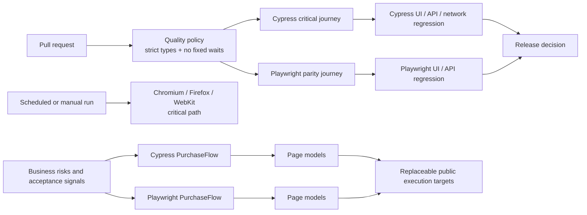

# Northstar Commerce Quality Framework

[](https://github.com/dmytropogribnyy/playwright-cypress-automation/actions/workflows/ci.yml)


**Release assurance for a commerce product, with a controlled Cypress-to-Playwright migration.**

Northstar protects the customer journey from authentication through order confirmation across UI, API, and network layers. It combines fast pull-request feedback, full regression gates, cross-browser scheduled coverage, financial invariants, and failure evidence designed for remote triage.

> Public execution targets make the complete implementation safe to review and run without exposing proprietary source code, customer data, credentials, or private infrastructure. The delivery model, architecture, release gates, and migration controls are designed as they would be for a client engagement.

---

## Executive snapshot

| Capability | Delivered |
|---|---|
| Critical purchase journey | Login → product → cart → checkout → order confirmation |
| Business invariant | Order subtotal + tax must equal displayed total |
| Negative coverage | Invalid login, missing checkout data, form validation |
| Migration proof | Same critical journey implemented in Cypress and Playwright |
| PR feedback | Strict TypeScript, stability policy, smoke parity, regression suites |
| Scheduled confidence | Playwright critical path on Chromium, Firefox, and WebKit |
| Failure evidence | Screenshots, video, Playwright trace, HTML reports, CI summaries |
| Operational decision | Final `Release decision` gate blocks when any required control fails |

The suite is intentionally compact. It demonstrates a maintainable quality operating model rather than inflating the repository with repetitive checks.

---

## Business problem

A commerce team increasing release frequency needs to answer five practical questions before merging:

1. Can a customer authenticate?
2. Can a product move through cart and checkout to confirmation?
3. Are required data and financial totals validated correctly?
4. Did dependent resources or service contracts drift?
5. Will a failure leave enough evidence to act without reproducing it locally?

Northstar maps those risks to executable controls:

| Risk | Automated control |
|---|---|
| Authentication is unavailable | Positive critical path and rejected-credential regression |
| Cart state is lost | Named product and quantity assertions |
| Checkout is blocked or accepts incomplete data | Complete purchase flow plus negative field validation |
| Order totals are inconsistent | `subtotal + tax = total` reconciliation in both runners |
| Required resources fail silently | Network status and content-type validation |
| API contracts become unusable | Typed payload and required-property assertions |
| Timing workarounds create flakiness | Repository-wide no-fixed-waits gate |
| CI failures are hard to diagnose | Screenshots, video, trace, reports, artifacts, and job summaries |

Full mapping: [Risk and coverage traceability](docs/TRACEABILITY.md).

---

## Delivery architecture



The framework separates:

- **business intent** — risks, acceptance signals, and critical flows;
- **domain flows** — reusable purchase orchestration above page-level mechanics;
- **page models** — selectors and page interactions;
- **execution profiles** — smoke, regression, and cross-browser slices;
- **release controls** — required CI gates, evidence, and a final decision job.

---

## Cypress-to-Playwright migration proof

The two runners are not presented as permanent duplication. They model a controlled modernization of an existing Cypress estate.

The same release-blocking commerce path now runs in both:

```text
Valid authentication
→ select Sauce Labs Backpack
→ verify cart quantity
→ provide checkout data
→ verify product in order review
→ reconcile subtotal, tax, and total
→ finish order
→ verify confirmation
```

### Why dual-run temporarily?

- Cypress preserves the established baseline and existing network/API coverage.
- Playwright proves equivalent business outcomes with richer tracing and cross-browser capability.
- Independent CI jobs expose disagreements instead of allowing a rewrite to silently reduce coverage.
- Retirement criteria are explicit, so migration does not become indefinite duplicate maintenance.

Detailed strategy: [Cypress to Playwright migration](docs/MIGRATION_STRATEGY.md).

---

## Current executable coverage

| Risk area | Cypress | Playwright |
|---|---|---|
| Valid authentication | Critical smoke | Migration-parity smoke |
| Invalid authentication | Regression | Planned parity increment |
| Product selection and cart state | Critical smoke | Migration-parity smoke |
| Complete checkout | Critical smoke | Migration-parity smoke |
| Order-total reconciliation | Critical smoke | Migration-parity smoke |
| Missing postal code | Regression | Regression |
| Network resource health | Regression | Not duplicated |
| User-service API | Regression | Not duplicated |
| Content-service API | Not duplicated | Regression |
| Customer form validation | Not duplicated | Regression |
| Cross-browser critical path | Not applicable | Scheduled/manual Chromium, Firefox, WebKit |

Unique runner value is preserved where duplication would add little confidence. Critical migration parity is required where a regression would directly block revenue flow.

---

## CI quality model

### Required pull-request gates

| Gate | Purpose |
|---|---|
| Quality policy | Strict TypeScript and no fixed waits |
| Cypress smoke | Established critical purchase baseline |
| Playwright smoke | Migration parity for the same customer outcome |
| Cypress regression | Authentication, checkout validation, network, and API controls |
| Playwright regression | Commerce validation, customer forms, API, and diagnostics |
| Release decision | Aggregates required results and blocks when any gate is not green |

### Scheduled and manual confidence

Scheduled and manually dispatched workflows additionally run the critical Playwright journey across:

- Chromium;
- Firefox;
- WebKit.

This keeps pull requests fast while still detecting browser-specific behaviour and external target drift.

### Operator-facing result

Every workflow produces a GitHub Actions summary containing:

- gate results;
- the protected journey;
- browser scope;
- a direct run link;
- a final `PASS` or `BLOCKED` release decision.

More detail: [Release gates](docs/RELEASE_GATES.md).

---

## Failure diagnostics

### Cypress

- screenshot on failure;
- video recording;
- CI logs;
- separate smoke and regression evidence packages.

### Playwright

- screenshot on failure;
- retained trace on failure;
- retained video on failure;
- HTML report uploaded for successful and failed smoke/regression runs;
- cross-browser report on scheduled/manual execution.

Inspect a trace locally:

```bash
npx playwright show-trace test-results/<run>/trace.zip
```

The operational standard is that a failure should answer what broke, what the system returned, and what evidence is available before anyone reruns the scenario locally.

---

## Repository structure

```text
cypress/
  e2e/
    smoke/      commerce-checkout.cy.ts
    ui/         authentication, checkout validation, network
    api/        service contract coverage
  flows/        PurchaseFlow.ts
  pages/        login, inventory, cart, checkout page models

playwright/
  tests/
    commerce/   checkout.spec.ts
    ui/         customer form coverage
    api/        service contract coverage
  flows/        PurchaseFlow.ts
  pages/        commerce and form page models
  fixtures/     route-level environmental controls

docs/
  QUALITY_STRATEGY.md
  RELEASE_GATES.md
  MIGRATION_STRATEGY.md
  TRACEABILITY.md

.github/workflows/ci.yml
scripts/check-no-hard-waits.js
scripts/cypress-run.js
```

---

## Run locally

### Prerequisites

- Node.js 22;
- a Reqres API key for the authenticated Cypress API scenario.

```bash
npm ci
npm run pw:install
cp .env.example .env
```

Set `REQRES_API_KEY` in `.env`. Other public execution-target values have documented defaults.

### Commands

```bash
# Static quality policy
npm run quality

# Fast critical paths
npm run cy:smoke
npm run pw:smoke
npm run test:smoke

# Supporting regression slices
npm run cy:regression
npm run pw:regression

# Chromium release verification
npm run verify

# Critical Playwright path on all configured browsers
npm run pw:cross-browser

# Interactive development
npm run cy:open
npm run pw:headed
npm run pw:report
```

---

## Environment configuration

| Variable | Purpose | Default |
|---|---|---|
| `SAUCE_BASE_URL` | Commerce execution target | `https://www.saucedemo.com` |
| `SAUCE_USERNAME` | Dedicated test user | `standard_user` |
| `SAUCE_PASSWORD` | Test password | `secret_sauce` |
| `DEMOQA_BASE_URL` | Supporting form target | `https://demoqa.com` |
| `REQRES_BASE_URL` | Cypress service target | `https://reqres.in` |
| `REQRES_API_KEY` | Reqres authentication | Required for that scenario |
| `JSONPLACEHOLDER_BASE_URL` | Playwright service target | `https://jsonplaceholder.typicode.com` |

Secrets belong in the local environment or GitHub Actions secret store. The framework does not silently downgrade authenticated coverage when a required key is missing.

---

## Engineering standards

- strict TypeScript compilation;
- no fixed sleeps or hard waits;
- stable, intent-revealing selectors;
- Page Objects for mechanics and domain flows for business journeys;
- isolated, repeatable scenarios;
- named product assertions instead of positional assumptions;
- financial invariant validation instead of page-presence checks alone;
- independent smoke parity during migration;
- retries treated as diagnostic evidence, not as proof of stability;
- failure evidence retained through CI artifacts;
- every release-blocking scenario mapped to a documented risk.

Quality rationale: [Quality strategy](docs/QUALITY_STRATEGY.md).

---

## Explicit boundaries

- Public targets can change without notice and are not controlled by this repository.
- The executable scope is a focused release-assurance slice, not complete e-commerce coverage.
- No production customer data, proprietary application code, private credentials, or invented outcome metrics are included.
- Performance, accessibility, visual regression, security testing, and production test-data provisioning remain separate expansion tracks.

The purpose of the repository is to make engineering quality visible: what is protected, why it matters, how a migration is controlled, what blocks a release, and what evidence is available when something fails.
